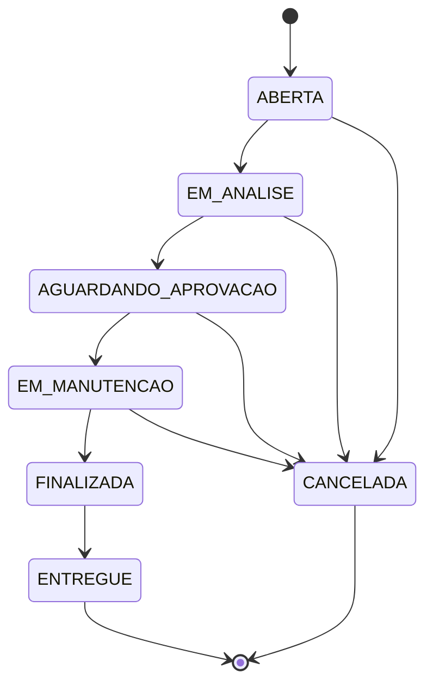
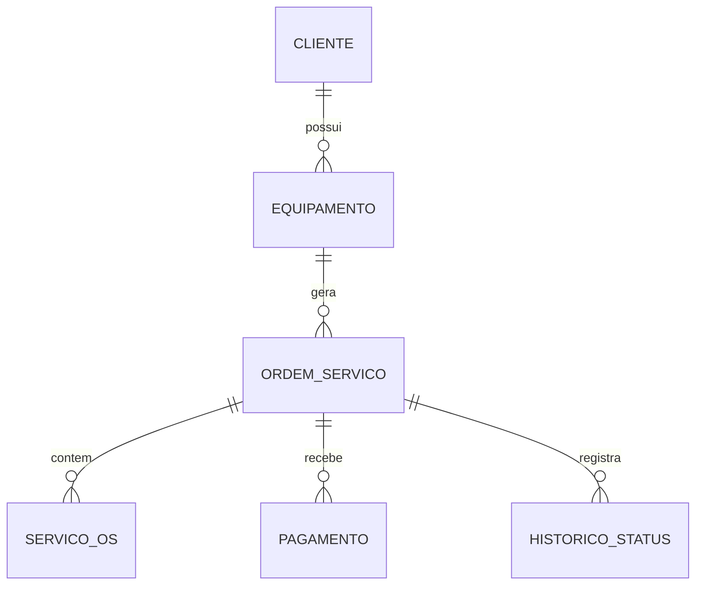

# 🛠️ Sistema de Ordem de Serviço

Aplicação de console desenvolvida em **Java 17** e **MySQL**, utilizando **JDBC**, para simular o gerenciamento do ciclo de uma assistência técnica.

O sistema permite cadastrar clientes e equipamentos, abrir ordens de serviço, registrar diagnósticos, calcular orçamentos, controlar pagamentos e acompanhar o histórico de status de cada atendimento.

```text
Cliente
   ↓
Equipamento
   ↓
Ordem de Serviço
   ↓
Diagnóstico
   ↓
Serviços
   ↓
Pagamento
```

## 🚀 Funcionalidades

* Cadastro e edição de clientes
* Cadastro de equipamentos vinculados aos clientes
* Abertura de ordens de serviço
* Registro do defeito relatado pelo cliente
* Registro de diagnóstico técnico
* Adição de serviços à ordem de serviço
* Cálculo automático do orçamento
* Controle de status da OS
* Validação das transições de status
* Registro de pagamentos parciais ou totais
* Controle de saldo devedor
* Histórico de alterações de status
* Histórico de ordens de serviço por cliente
* Validação das principais regras de negócio
* Operações transacionais no banco de dados

## 🔄 Fluxo da Ordem de Serviço



### Status disponíveis

| Status                 | Descrição                        |
| ---------------------- | -------------------------------- |
| `ABERTA`               | OS criada e aguardando análise   |
| `EM_ANALISE`           | Equipamento em avaliação         |
| `AGUARDANDO_APROVACAO` | Orçamento enviado ao cliente     |
| `EM_MANUTENCAO`        | Serviço autorizado e em execução |
| `FINALIZADA`           | Manutenção concluída             |
| `ENTREGUE`             | Equipamento entregue ao cliente  |
| `CANCELADA`            | OS encerrada sem conclusão       |

## 📋 Regras de negócio

O sistema possui validações para garantir que o fluxo da assistência técnica siga regras coerentes.

* Diagnóstico e serviços só podem ser registrados quando a OS estiver em `EM_ANALISE`.
* Para enviar a OS para `AGUARDANDO_APROVACAO`, é necessário possuir um diagnóstico e pelo menos um serviço.
* A mudança de `AGUARDANDO_APROVACAO` para `EM_MANUTENCAO` exige a aprovação do orçamento pelo cliente.
* Pagamentos só podem ser registrados quando a OS estiver `FINALIZADA`.
* O valor pago não pode ultrapassar o saldo devedor.
* Uma OS só pode ser marcada como `ENTREGUE` após o pagamento total.
* Uma OS que já possui pagamentos registrados não pode ser cancelada.
* `ENTREGUE` e `CANCELADA` são estados finais.
* Cada alteração de status é registrada na tabela `historico_status`.
* A alteração do status e seu respectivo histórico são realizados na mesma transação.
* A linha da OS é bloqueada com `SELECT ... FOR UPDATE` durante alterações que exigem controle de concorrência.

## 🗄️ Modelo de dados



### Principais entidades

```text
CLIENTE
   │
   └── EQUIPAMENTO
          │
          └── ORDEM_SERVICO
                 ├── SERVICO_OS
```
