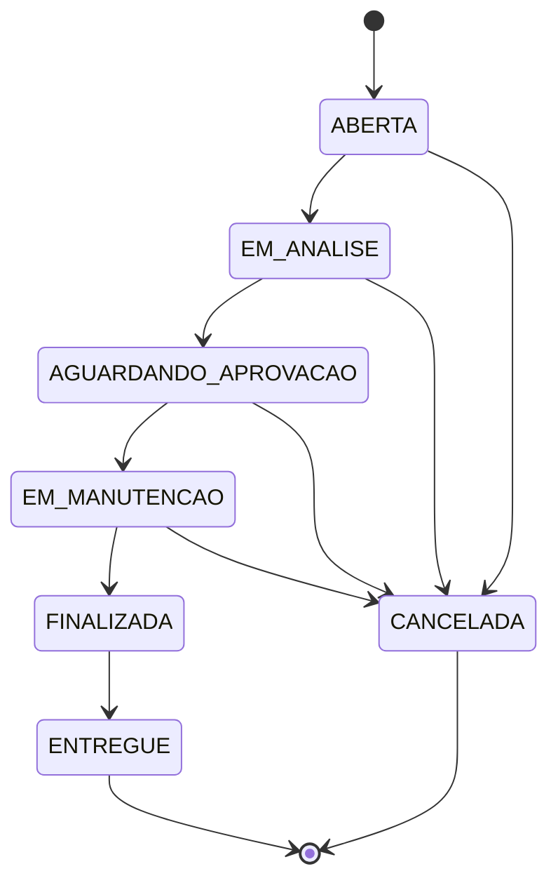
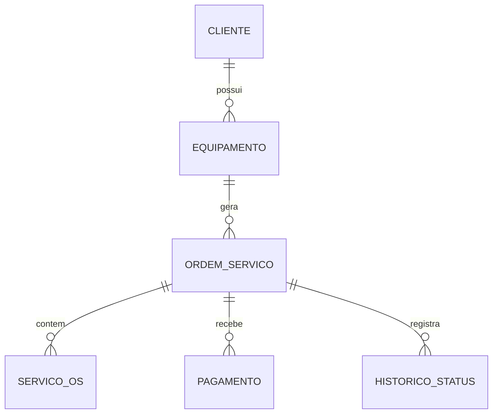

# 🛠️ Sistema de Ordem de Serviço

Aplicação de console desenvolvida em **Java 17** e **MySQL**, utilizando **JDBC**, para simular o gerenciamento do ciclo de uma assistência técnica.

O sistema permite cadastrar clientes e equipamentos, abrir ordens de serviço, registrar diagnósticos, calcular orçamentos, controlar pagamentos e acompanhar o histórico de status de cada atendimento.

```text
Cliente
   ↓
Equipamento
   ↓
Ordem de Serviço
   ↓
Diagnóstico
   ↓
Serviços
   ↓
Pagamento
```

## 🚀 Funcionalidades

* Cadastro e edição de clientes
* Cadastro de equipamentos vinculados aos clientes
* Abertura de ordens de serviço
* Registro do defeito relatado pelo cliente
* Registro de diagnóstico técnico
* Adição de serviços à ordem de serviço
* Cálculo automático do orçamento
* Controle de status da OS
* Validação das transições de status
* Registro de pagamentos parciais ou totais
* Controle de saldo devedor
* Histórico de alterações de status
* Histórico de ordens de serviço por cliente
* Validação das principais regras de negócio
* Operações transacionais no banco de dados

## 🔄 Fluxo da Ordem de Serviço



### Status disponíveis

| Status                 | Descrição                        |
| ---------------------- | -------------------------------- |
| `ABERTA`               | OS criada e aguardando análise   |
| `EM_ANALISE`           | Equipamento em avaliação         |
| `AGUARDANDO_APROVACAO` | Orçamento enviado ao cliente     |
| `EM_MANUTENCAO`        | Serviço autorizado e em execução |
| `FINALIZADA`           | Manutenção concluída             |
| `ENTREGUE`             | Equipamento entregue ao cliente  |
| `CANCELADA`            | OS encerrada sem conclusão       |

## 📋 Regras de negócio

O sistema possui validações para garantir que o fluxo da assistência técnica siga regras coerentes.

* Diagnóstico e serviços só podem ser registrados quando a OS estiver em `EM_ANALISE`.
* Para enviar a OS para `AGUARDANDO_APROVACAO`, é necessário possuir um diagnóstico e pelo menos um serviço.
* A mudança de `AGUARDANDO_APROVACAO` para `EM_MANUTENCAO` exige a aprovação do orçamento pelo cliente.
* Pagamentos só podem ser registrados quando a OS estiver `FINALIZADA`.
* O valor pago não pode ultrapassar o saldo devedor.
* Uma OS só pode ser marcada como `ENTREGUE` após o pagamento total.
* Uma OS que já possui pagamentos registrados não pode ser cancelada.
* `ENTREGUE` e `CANCELADA` são estados finais.
* Cada alteração de status é registrada na tabela `historico_status`.
* A alteração do status e seu respectivo histórico são realizados na mesma transação.
* A linha da OS é bloqueada com `SELECT ... FOR UPDATE` durante alterações que exigem controle de concorrência.

## 🗄️ Modelo de dados



### Principais entidades

```text
CLIENTE
   │
   └── EQUIPAMENTO
          │
          └── ORDEM_SERVICO
                 ├── SERVICO_OS
                 ├── PAGAMENTO
                 └── HISTORICO_STATUS
```

## 🏗️ Estrutura do projeto

```text
├── pom.xml
│
├── sql/
│   ├── schema.sql
│   └── dados-exemplo.sql
│
└── src/
    ├── main/
    │   └── java/
    │       └── com/
    │           └── assistencia/
    │               ├── Main.java
    │               │
    │               ├── model/
    │               │   ├── records
    │               │   └── enums
    │               │
    │               ├── dao/
    │               │   └── acesso ao banco
    │               │
    │               ├── service/
    │               │   └── regras de negócio
    │               │
    │               ├── ui/
    │               │   └── menus do console
    │               │
    │               └── util/
    │                   ├── ConexaoFactory
    │                   └── utilitários
    │
    └── test/
        └── java/
            └── testes JUnit 5
```

## 💻 Tecnologias utilizadas

* **Java 17**
* **Maven**
* **MySQL 8**
* **JDBC**
* **JUnit 5**
* **PreparedStatement**
* **Transactions**
* **Records e Enums**
* **Mermaid** para diagramas

## 🔐 Acesso ao banco de dados

As informações de conexão não ficam diretamente no código.

O sistema utiliza variáveis de ambiente:

```bash
DB_URL="jdbc:mysql://localhost:3306/assistencia_tecnica?useSSL=false&allowPublicKeyRetrieval=true&serverTimezone=America/Sao_Paulo"
DB_USER="root"
DB_PASS="sua_senha"
```

No **Windows PowerShell**:

```powershell
$env:DB_URL = "jdbc:mysql://localhost:3306/assistencia_tecnica?useSSL=false&allowPublicKeyRetrieval=true&serverTimezone=America/Sao_Paulo"
$env:DB_USER = "root"
$env:DB_PASS = "sua_senha"
```

## ⚙️ Como executar

### Pré-requisitos

* JDK 17 ou superior
* Maven 3.8+
* MySQL 8.0.16 ou superior

### 1. Clone o repositório

```bash
git clone https://github.com/seu-usuario/seu-repositorio.git
cd seu-repositorio
```

### 2. Crie o banco de dados

Execute o script:

```bash
mysql -u root -p < sql/schema.sql
```

Para carregar dados de exemplo:

```bash
mysql -u root -p assistencia_tecnica < sql/dados-exemplo.sql
```

### 3. Configure as variáveis de ambiente

Defina `DB_URL`, `DB_USER` e `DB_PASS` conforme sua instalação do MySQL.

### 4. Compile e execute

```bash
mvn compile exec:java
```

### 5. Execute os testes

```bash
mvn test
```

## 🧪 Testes

O projeto utiliza **JUnit 5** para testes automatizados.

Execute:

```bash
mvn test
```

Os testes têm como objetivo validar principalmente as regras de negócio e o comportamento esperado das operações do sistema.

## 📚 Objetivos do projeto

Este projeto foi desenvolvido com foco no estudo e aplicação prática de conceitos importantes do desenvolvimento backend com Java, como:

* Programação Orientada a Objetos
* Separação de responsabilidades
* Arquitetura em camadas
* Acesso a banco de dados com JDBC
* SQL e relacionamentos
* PreparedStatement
* Transações
* Controle de concorrência
* Tratamento de regras de negócio
* Testes automatizados
* Organização e documentação de projetos

## 🔮 Próximos passos

Algumas funcionalidades planejadas para futuras versões:

* Interface gráfica com Swing ou JavaFX
* Migração para API REST com Spring Boot
* Autenticação e autorização de usuários
* Cadastro de técnicos
* Controle de peças utilizadas
* Relatórios de faturamento
* Relatórios de OS por status
* Dashboard de indicadores
* Testes de integração com Testcontainers

## 👨‍💻 Autor

**Samuel Covalski**

Projeto desenvolvido como parte dos estudos de **Desenvolvimento de Sistemas e Java**, com foco na construção de aplicações práticas e no desenvolvimento de conhecimentos para backend.

---

⭐ Se este projeto foi útil para seus estudos, considere deixar uma estrela no repositório.
